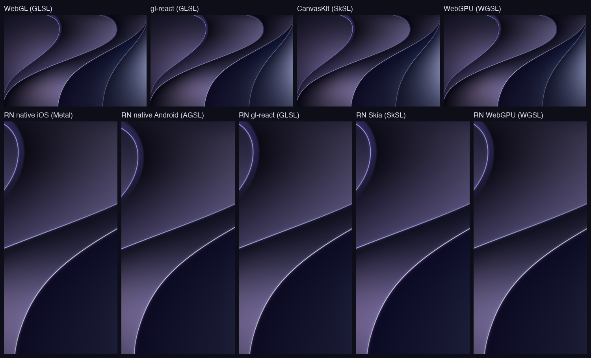
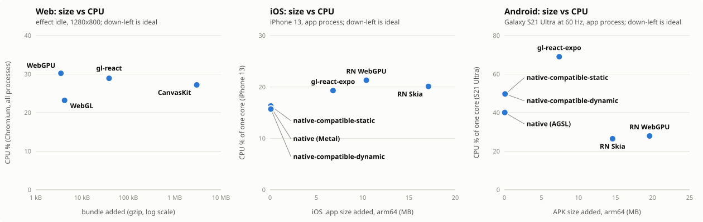
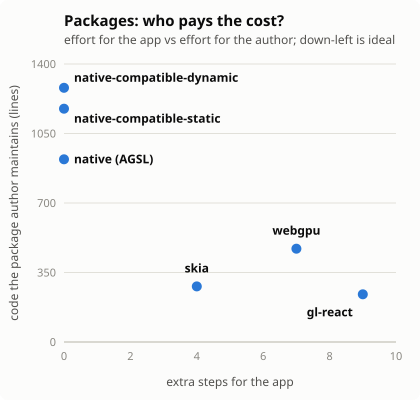

# benchmark-shader-solutions

**One shader, twelve apps:** the same animated background on the web and on
React Native, built with every mainstream GPU stack, then compared on
performance, bundle/binary size, `node_modules` weight and developer
experience.

| Target (macOS wallpaper, still frame) | Our shader at t = 0 |
|---|---|
|  |  |

The effect ("Silk") is a procedural fragment shader, with no textures. It
draws 4 S-curved sheets with rim lights, soft shadows and fabric shading, and
animates slowly: the curves undulate, the rim glow breathes and the hue drifts.
It was fitted to the target image and then ported to 5 shading languages. All
ports produce the same pixels.



## Results in short

Full report: **[RESULTS.md](RESULTS.md)**. In short, the shader itself ports
easily to every tech. What differs is the cost around it.

**Web** (Chromium with hardware GPU, 1280×800; size = gzip added vs web-baseline):

| | size added | CPU (idle) | first frame | animation runs on | extra deps / config | browsers |
|---|---|---|---|---|---|---|
| WebGL | +4 kB | 23 % | 54 ms | main thread | none | all |
| WebGPU | +3.5 kB | 30 % (37 % at 2560×1600) | 61 ms | main thread | none | Chrome/Edge 113+, Safari 26, Firefox (Windows) |
| gl-react | +38 kB | 29 % | 72 ms | main thread + a React re-render per frame | 2 packages + a Vite `define` | all |
| CanvasKit | +3 MB (wasm) | 27 % | 137 ms (336 ms cold) | main thread | 1 package (wasm) | all |

**React Native** (iPhone 13, Release; size = iOS `.app` added vs rn-baseline):

| | size added | CPU (iPhone 13) | GPU busy (iPhone 13, 60 fps) | animation runs on | extra steps for the app | edit shader → see it | min OS |
|---|---|---|---|---|---|---|---|
| native (Metal / AGSL) | +0.07 MB (APK +0.2 MB) | 16 % | 23 % | native loop, 0 JS per frame | none, but ~700 native lines to own | native rebuild (~39 s on iOS) | iOS 15.1 · Android 13 for the effect |
| native-compatible-static (Metal / OpenGL ES, shaders in the app) | +0.08 MB (APK +0.2 MB) | 16 % | 23 % | native loop, 0 JS per frame | none, but ~880 native lines to own | native rebuild | iOS 15.1 · Android 7.1 · RN ≥ 0.81 |
| native-compatible-dynamic (same, shaders passed from JS) | +0.09 MB (APK +0.23 MB) | 16 % | 23 % | native loop, 0 JS per frame | none, but ~940 native lines to own | Fast Refresh (also over the air); +10–20 ms Metal compile on first iOS launch | iOS 15.1 · Android 7.1 · RN ≥ 0.81 |
| RN Skia | +17 MB | 20 % (renders at 3x) | 63 % | UI thread | 3 peers + Babel plugin | Fast Refresh | iOS 15.1 · Android 7 |
| RN WebGPU | +10 MB | 21 % | 23 % | UI thread (worklets) | 3 peers + a patch + Podfile edit + minSdk 26 | Fast Refresh | iOS 15.1 · Android 8 |
| gl-react-expo | +7 MB | 19 % (3x + MSAA, 195 MB) | 76 % | JS thread, blocking | Expo modules + a patch + Podfile flags | Metro reload | iOS 16.4 · Android 7 ⁽ᵃ⁾ |

On a real Android phone (Galaxy S21 Ultra, Android 15, display at 60 Hz), app
CPU is: Skia 27 %, WebGPU 28 %, native AGSL 40 %, native OpenGL ES 49 % (static
and dynamic alike), gl-react 69 % (baseline 18 %). Skia and WebGPU render on
their own surface; our native views pay for compositing a `TextureView`. All
hold 60 fps.

First frame of the effect (from JS start, iPhone 13, first launch after
install, 2 launches): native 81–102 ms (static and dynamic alike), gl-react
80–87 ms, Skia 143–158 ms, WebGPU 143–270 ms; on relaunch every native variant
is under 51 ms.

⁽ᵃ⁾ On Android, Expo SDK 57 (the only one usable with RN 0.87) needed 4 more
fixes for RN 0.87's Gradle 9.4 / AGP 9 (2 patches, 2 Gradle settings). An Expo
SDK aligned with the RN version should not need them.

Every web tech holds 120 fps on this machine, so CPU shows the difference,
not frame drops. On the iPhone every RN app holds 60 fps; at the same 2x
scale the shader takes the same GPU time (~3.8 ms per frame) with Metal or
WebGPU, while Skia and gl-react render at 3x and cost ~3x the GPU. Details and
caveats: [RESULTS.md](RESULTS.md) (§1 performance, §3 size, §7 developer
experience, §8 platform support).





**Recommendations:**

- **Web: raw WebGL.** +4 kB, lowest CPU, every browser, no dependencies.
  Use CanvasKit only if you already use Skia, given its 3 MB of wasm.
- **RN, smallest and broadest: a native component**, in its compatible form
  (Metal / OpenGL ES). It adds ~0.1 MB, runs off the JS thread, has the
  lowest CPU on iOS, and supports RN ≥ 0.81, iOS 15.1+ and Android 7.1+.
  Android reuses the web's GLSL. On Android its app process uses more CPU
  than Skia's or WebGPU's (it composites a `TextureView`). It means ~880–940 native lines to own. Two
  flavors:
  - **static** (shaders in the app): errors at build time, rebuild to change
    a shader;
  - **dynamic** (shaders from JS): Fast Refresh and over-the-air updates, for
    ~10–20 ms of Metal compilation on the first launch after install on iOS.

  The AGSL variant only shows the effect on Android 13+.
- **RN, best developer experience: RN Skia.** Works out of the box, UI-thread
  animation, Fast Refresh. It adds 17 MB and gives no control over render
  resolution.
- **Sharing web ↔ RN: WebGPU.** One WGSL shader and nearly the same JS on
  both. Its RN lib is young and needed patches; +10 MB.
- **Avoid gl-react on RN today.** It depends on Expo and OpenGL ES, blocks the
  JS thread each frame, and needed the most workarounds. These findings are
  tracked upstream to improve the lib: [gre/gl-react#540](https://github.com/gre/gl-react/issues/540).

**As reusable packages** ([components/](components/README.md)):

- A package can't carry its dependencies' fixes. Patches, Podfile settings
  and Expo all land in the app; the best a package can do is ship them as
  one-line hooks.
- Native code is the cheapest for the app and the costliest for the author.
- One shared uniform contract was enough to make shaders pluggable across
  all 6 packages and 5 shading languages.
- Test the packed package in dev mode, and test the libraries together.
  Both surfaced bugs that the individual tests missed.

**Other possible approaches (not studied):**
- a pre-rendered video loop (no shader at all);
- three.js / react-three-fiber (incl. its WebGPU renderer and TSL);
- TypeGPU (shaders written in TypeScript, web + RN);
- WebGL in a Worker (`OffscreenCanvas`, off the main thread);
- SwiftUI Metal shader modifiers / Android `RenderEffect`;
- small WebGL helpers (regl, OGL, twgl);
- an Expo-managed app instead of bare React Native.

## The apps

Every app lives in its own folder under `apps/` and is **fully
independent**. It has its own `package.json`, lockfile and `node_modules`, and
nothing is shared. You can move any folder out of the repo and it still builds.
Within a platform, the stack and versions are identical; only the graphics
library and the shader language differ.

| app | platform | graphics | shader |
|---|---|---|---|
| [`web-baseline`](apps/web-baseline) | Web (Vite + React) | none (solid color) | — |
| [`web-webgl`](apps/web-webgl) | Web | raw WebGL 1, no lib | GLSL |
| [`web-gl-react`](apps/web-gl-react) | Web | `gl-react` + `gl-react-dom` | GLSL |
| [`web-skia`](apps/web-skia) | Web | `canvaskit-wasm` | SkSL |
| [`web-webgpu`](apps/web-webgpu) | Web | raw WebGPU, no lib | WGSL |
| [`rn-baseline`](apps/rn-baseline) | iOS + Android (bare RN 0.87) | none (solid color) | — |
| [`rn-native`](apps/rn-native) | iOS + Android | own Fabric component, no lib | Metal (iOS) / AGSL (Android) |
| [`rn-native-compatible-static`](apps/rn-native-compatible-static) | iOS + Android (RN ≥ 0.81, Android 7.1+) | own Fabric component, shaders compiled into the app | Metal (iOS) / GLSL on OpenGL ES (Android) |
| [`rn-native-compatible-dynamic`](apps/rn-native-compatible-dynamic) | iOS + Android (RN ≥ 0.81, Android 7.1+) | own Fabric component, shaders passed from JS | Metal (iOS) / GLSL on OpenGL ES (Android) |
| [`rn-gl-react`](apps/rn-gl-react) | iOS + Android | `gl-react` + `gl-react-expo` (`expo-gl`) | GLSL |
| [`rn-skia`](apps/rn-skia) | iOS + Android | `@shopify/react-native-skia` | SkSL |
| [`rn-webgpu`](apps/rn-webgpu) | iOS + Android | `react-native-wgpu` / `react-native-webgpu` | WGSL |

The baselines render the same app shell (FPS overlay, clock) with no GPU
library. They exist to measure the cost each tech **adds**.

Each app's `README.md` has how to run it, its exact stack and the
workarounds it needs. Measurements and comparisons are in
[RESULTS.md](RESULTS.md).

## Universal packages (`components/`)

The study also asks what **reusable packages** would look like. Each of
`components/{native,native-compatible-static,native-compatible-dynamic,skia,webgpu,gl-react}`
exports one component that works
in a React web app and in a React Native app, with the same minimal API:

```tsx
<Effect shader="silk" params={{ speed: 0.2, amp: 1 }} style={...} />
```

Each package is standalone, depends only on external libraries, and has
pluggable shaders. See [components/README.md](components/README.md) for what
each package costs the app that uses it, and what adding a shader costs.

## Shader contract

Every implementation gets the same two uniforms: `resolution` (viewport
size) and `phase` (a `vec4`). Each component of `phase` is an animation
phase in [0, 1), computed on the CPU in double precision as
`fract(t / P)` with periods P = 41, 59, 23 and 53 s. The shader never sees
large time values, so it stays precise on mobile GPUs. The reference
1200×775 framing is "cover"-fitted to any aspect ratio.

## Repository layout

```
apps/        the 12 apps (see above)
components/  the same effect as 6 standalone, universal (web + RN) <Effect> packages + example apps
shaders/     the shader in 5 languages + dev tools
  silk.glsl    GLSL ES 1.00, source of truth (uniform contract in its header)
  silk.sksl    Skia RuntimeEffect      silk.agsl   Android RuntimeShader
  silk.wgsl    WebGPU                  silk.metal  Metal
  harness/     live tuning page (raw WebGL) + SkSL / WebGPU check pages
  compare.mjs  renders every port and diffs them (SSIM, mean abs diff) → shaders/out/
  metal-check/ offscreen Metal render to PNG (Swift)
metrics/     measurement scripts (sizes, web perf, iOS / Android device perf, stack check)
docs/        images used by this README (target, our render, all implementations)
RESULTS.md   the full comparison report
```

## Quick start

```sh
# Shader playground (raw WebGL, live reload, sliders, side-by-side with the target)
python3 -m http.server 5160 --bind 127.0.0.1    # from the repo root
open http://127.0.0.1:5160/shaders/harness/index.html

# A web app
cd apps/web-webgpu && npm ci && npm run dev     # ?t=10 freezes time, ?fps shows the overlay

# A React Native app: see its README (npm ci, bundle install, pod install, xcodebuild)
```

Requirements: Node 24, Xcode 27 (iOS 27 SDK; the simulator UI is
`Xcode.app/Contents/Applications/DeviceHub.app`), CocoaPods via each app's
Gemfile, and for Android JDK 17 and Android SDK 37. Running on a physical
iPhone needs a paid Apple developer team.
